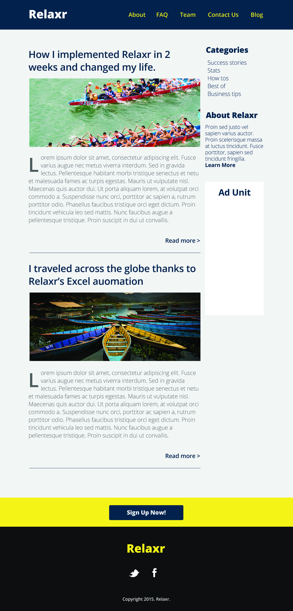

# FEWD Week #3: CSS Layouts


<br>

---


### Description 


Relaxr was really impressed by your work last week and wants you to continue development on their landing page. Starting in class, you will work to build out a more complex layout for their company site. They decided on creating a blog, and their back-end engineers will be focused on developing the blog's functionality. They want your front-end skills to style their designs using HTML and CSS so Relaxr's engineers can begin integrating. Once again, the designers have handed you a basic design file with instructions (see below) and the JPEG below to help you bring the blog to life. Submit the finished version for homework.



<br>

---

### Design File Instructions

* background color: #f0efef
* yellow: #f9e42e
* dark blue: #033048
* light grey: #606161
* almost black: #121212

* Font: Open Sans (Google Font: https://www.google.com/fonts#UsePlace:use/Collection:Open+Sans)
* Weight: Light, Light Italic, Semibold, Extrabold

* Nav: Semibold, 24px

* Main column width: 700px
* Sidebar width: 240px
* Gutter: 20px

* Post Titles - 40px, semibold
"How I implemented Relaxr in 2 weeks and changed my life."
"I traveled across the globe thanks to Relaxr’s Excel automation"

* Body text - Light 24px
* Read More - 24px semibold

* Sidebar headers - 32px, extra bold
* Categories list - 24px, light

#### Categories SideBar
* Success stories
* Stats
* How tos
* Best of
* Business tips

#### About
* About text - 22px light
* Learn More - Semibold, 22
* Proin sed justo vel sapien varius auctor. Proin scelerisque massa at luctus tincidunt. Fusce porttitor, sapien sed tincidunt fringilla.


<br>

---

### Real-World Applications

- Build websites with multi-column layouts
- Turn complex design assets into code
- Style text on your page with Google Fonts

<br>

---


### Technical Requirements 

- Use in-line-block or floats in your CSS to achieve a two-column layout
- Use the correct ```Open Sans``` Google Font typeface to style the text denoted in the design file with instructions (see above) and according to the JPEG provided
- Use proper filename conventions (lowercase, .html)
- Use a single external CSS stylesheet to style all pages
- Use a background image for the headers
- Add a hover effect to all the links using pseudo-classes
- Integrate drop caps using pseudo-classes


#### Bonus
- Link the "Blog" link in the header to the page you've built for this assignment
- Link the "About" link in the header to the [landing page](../../Week_02_Styling/Assignment/starter_code/images/relaxr_landing.jpg) you built last week
- Up for a real challenge? Use ```<script>``` tags in your HTML and [read ahead](https://learn.jquery.com/events/event-basics/) to make a dialogue box pop up when a user clicks "Sign Up Now!" that reads "We're Not Ready For Sign-Ups...Yet."

<br>

---

### Resources

- [Documentation on integrating Drop Caps](https://css-tricks.com/snippets/css/drop-caps/)
- [Documentation on CSS Pseudo-classes](http://www.w3schools.com/CSS/CSS_pseudo_classes.asp)
- [Starter Code, Assets, and Design File](starter_code/)
- [Prepare for JavaScript/jQuery](https://generalassemb.ly/online/videos/what-can-you-do-with-javascript)
- [Read ahead on jQuery basics](https://learn.jquery.com/events/event-basics/)

<br>

---